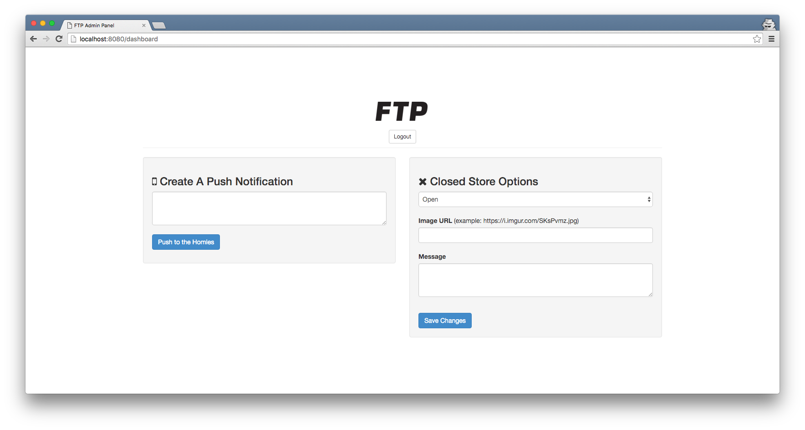

Currently in development.

<a href="https://twitter.com/ZACFTP/status/712079447071961093">Video Demo</a>

This App features the ability to get push updates on the latest FTP Releases on your desired platform (Android or iOS), access lookbooks, and purchase items from the FTP Shop. The app also features official updates from the FTP Twitter.

Have any question? feel free to <a href="mailto:thepcmrtim@gmail.com">Email me</a>.

<span>

<a href="https://itunes.apple.com/us/app/ftp-for-iphone/id1097416612?ls=1&mt=8"></img></a>

</img>

</span>


Development (iOS)
-----------

Clone the project & install the dependencies

Make sure you have your own Shopify Domain, API Key, and Shopify Channel ID. You can retrive this by simply setting up the <a href="https://docs.shopify.com/api/sdks/mobile-buy-sdk/add-mobile-app-sales-channel">Mobile App sales channel</a>, to retrive your key, domain, and channel id.

If you don't have CocoaPods installed on your machine ensure to install it via bash.
```bash
sudo gem install cocoapods
```

If you don't cocoapods-keys installed ensure to install it via bash.
```bash
sudo gem install cocoapods-keys
```

Clone Project

```bash
git clone https://github.com/dzt/ftp.git

cd ftp/ios

# Install dependencies
pod install

# Inside finder go into the <cloned directory>/ios and open up "FTP.xcworkspace"
```

iOS Dependencies/Libraries Used
-----------
<a href="https://github.com/Shopify/mobile-buy-sdk-ios">MobileBuy SDK</a>
</br>
<a href="https://github.com/Haneke/HanekeSwift">HanekeSwift</a>

Development (Server)
-----------

  - The server handles push notifications and the FTP Administration Panel.

  - The Administration Panel allows <a href="twitter.com/zacftp"></a> and I to make push notifications through out both clients (Android and iOS) using <a href="https://www.npmjs.com/package/push-notify">push-notify</a>. In addition the server allows us to close or open the FTP store and change the closed store page (picture and message).

Development (Android)
-----------


Screenshots
-----------


Notes & Q&A
-----------
- How to check the production key list and change there value? <b><a href="https://github.com/orta/cocoapods-keys">Here</a></b>
</br>
- Will there be an Android version? <b>Yes, there will be a complete Android version in the next upcoming days?</b>
</br>
- Is this the official FTP App? <b>Yes</b>
</br>

License
--------
This repository is licensed under MIT. See [LICENSE](https://github.com/dzt/ftp/blob/master/LICENSE) for the full license text.


